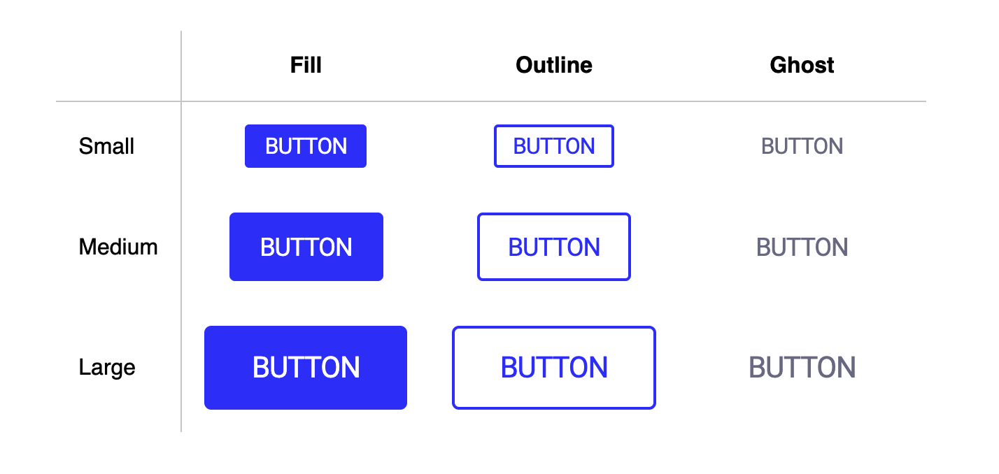

# Mini Button Library

## 🧪 Tecnologias

Esse projeto foi desenvolvido com as seguintes tecnologias:

- [React](https://reactjs.org)
- [styled-components](https://styled-components.com/)

---

## 💻 Projeto

O objetivo do projeto foi contruir uma mini biblioteca de componentes para uso pessoal praticando o uso de styled-components e CSS-Variables.

##  🔖 Design 

Confira o design proposto para a aplicação <a href="https://www.figma.com/file/rDeVdaes4jtX8V11Yt5aun/Button-Component?node-id=0%3A1">aqui!</a>